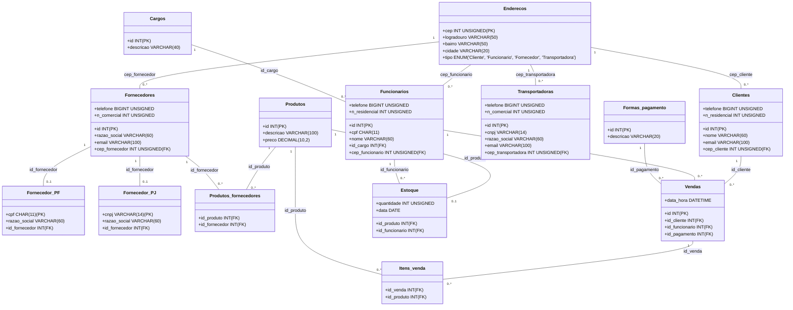

# Quitanda-DB

## Projeto Banco de Dados - Quitandaria

Este projeto foi desenvolvido como parte da disciplina de Banco de Dados e tem como objetivo a criação de um banco de dados para o sistema de uma quitandaria utilizando MySQL.

## Modelagem do Banco de Dados

O banco de dados possui as seguintes tabelas:

- **Enderecos**: Armazena informações sobre os endereços.
- **Clientes**: Contém os dados dos clientes da quitandaria.
- **Cargos**: Define os cargos dos funcionários.
- **Funcionarios**: Armazena informações dos funcionários da loja.
- **Fornecedores**: Lista os fornecedores de produtos.
- **Fornecedor_PF** e **Fornecedor_PJ**: Diferenciam fornecedores como Pessoa Física e Pessoa Jurídica.
- **Transportadoras**: Contém os dados das transportadoras.
- **Produtos**: Lista os produtos vendidos na quitandaria.
- **Produtos_fornecedores**: Define quais produtos são de quais fornecedores.
- **Formas_pagamento**: Lista as formas de pagamento aceitas.
- **Vendas**: Registra as vendas realizadas.
- **Itens_venda**: Relaciona as vendas com os produtos comprados.
- **Estoque**: Armazena a quantidade de produtos disponíveis.

